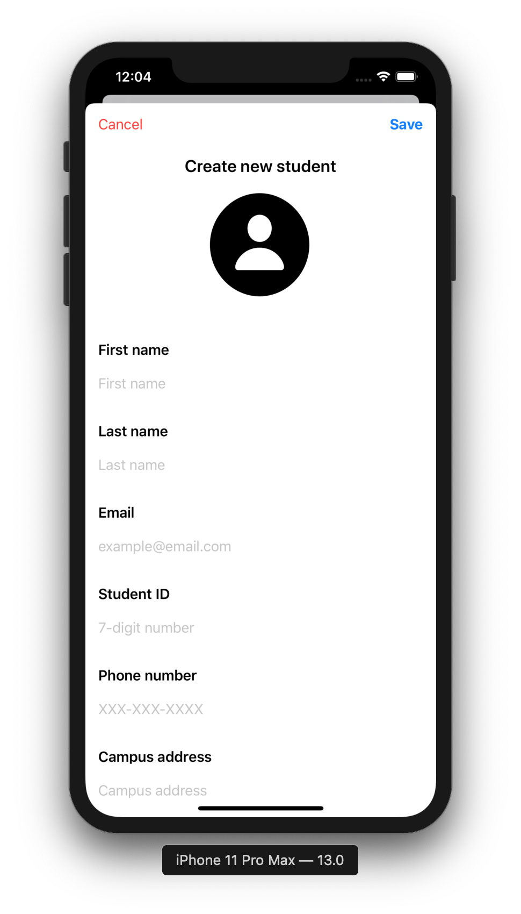
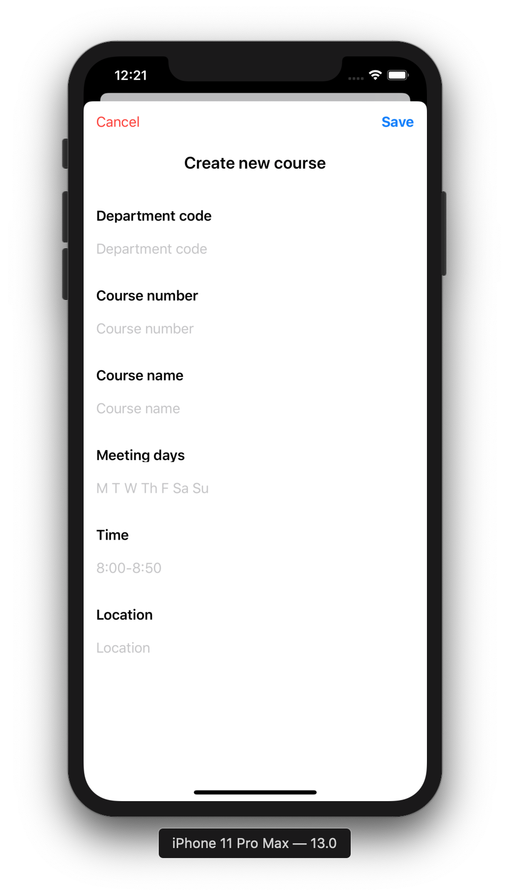
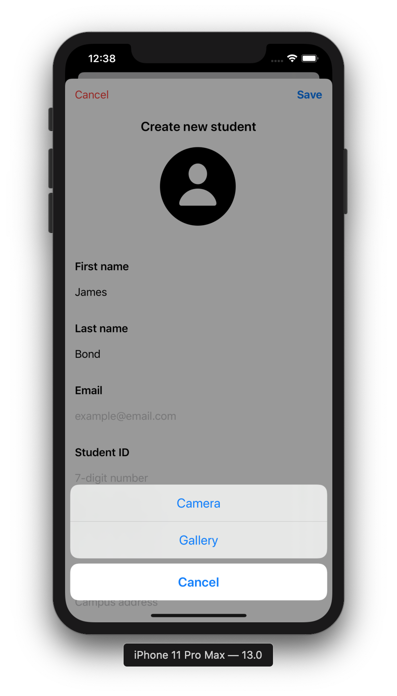
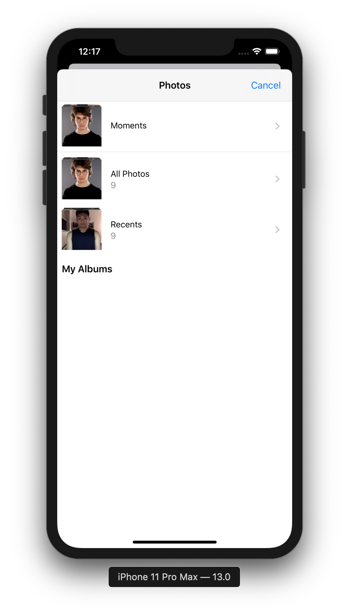

# Student Management System

A management app that keeps track of offered courses, students, and professors.

## Getting Started

Clone the project to where you want to have it on your local machine and run it with Xcode

## About

User can:
* Choose to see the list of students, professors, or courses.
* Add user with text info and picture.
* Add relation between student and class or between professor and course.

## App experience
### List view

  

### Create new

  

### Pick Image
* Pop up query

* Pop up gallery

* Edit image

### Filling forms
Form comes with a customized auto capitalize function for each text field as well as a custome key board.

  

## View
Views are customed to objects.

  

## Edit info
User could choose to edit an existing account's information

Or delete the whole account

## Relationship between different class of objects
### Viewing

 

### Editting

Since relations are two-way, adding one student in a class would make that class show up inside student's courses.

## Things that was applied
#### Tools
1. Xcode 11
1. Swift 5 
#### Elements used
1. Core Data
1. `UIViewController` subclass
1. `UISplitViewController`
1. `UITabBarViewController`
1. `UIImagePickerControllerDelegate`
1. `UIAlertController`
1. `UIImagePickerController`
1. `UITableViewController`
1. `init` of struct and class
1. `extension`
1. `UILabel`
1. `UIButton'
1. 'UITextField'
1. 'UITableView'
1. `UITableViewCell`
1. `UIBarButtonItem`
1. `UISegmentedControl`
1. `UIAlertAction`
1. `UIApplication`
1. `UIStoryboard`
1. Target/Action programmatically (`@objc`)
#### Types
1. Value type (`struct`, `enum`) versus reference type (`class`)
1. `Array<Element>`, `Dictionary<Key, Value>`, and `NSOrderedSet<Element>`
18. Optionals (including implicitly-unwrapped Optionals)
19. `??` optional defaulting operator
22. Type cast
#### Integration
1. Camera
1. Gallery
1. Keyboard
1. Segmented Control
1. Split View
1. Tab Bar
1. Embed TabBar inside SplitView
1. Embed SplitView inside TabBar (in a experimental branch)
1. Fetch data from Core Data for view, edit, create, and delete.
1. Show an AlertAction to choose between taking a new photo or picking one from the gallery
1. Settup views and elements programmatically
1. Reuse views for many different objects
1. `didSet`, `get`, `set` observer pattern
1. Use Segmented Control to show different view

## Versions

* **Version 1.0:** 

## Author

* [**Nhan Cao**](https://www.linkedin.com/in/nhan-cao/)
